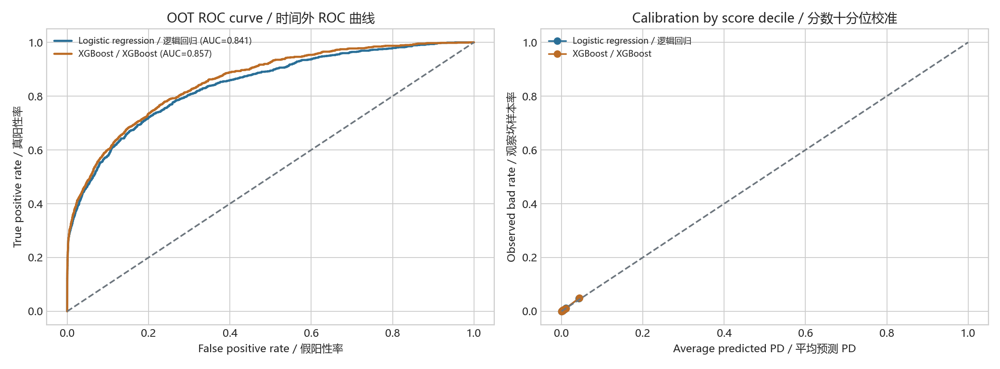
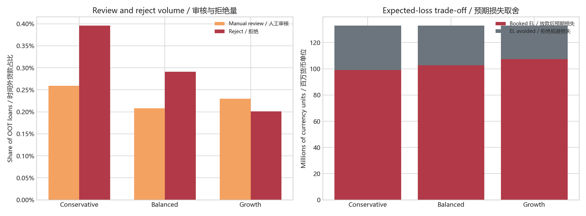
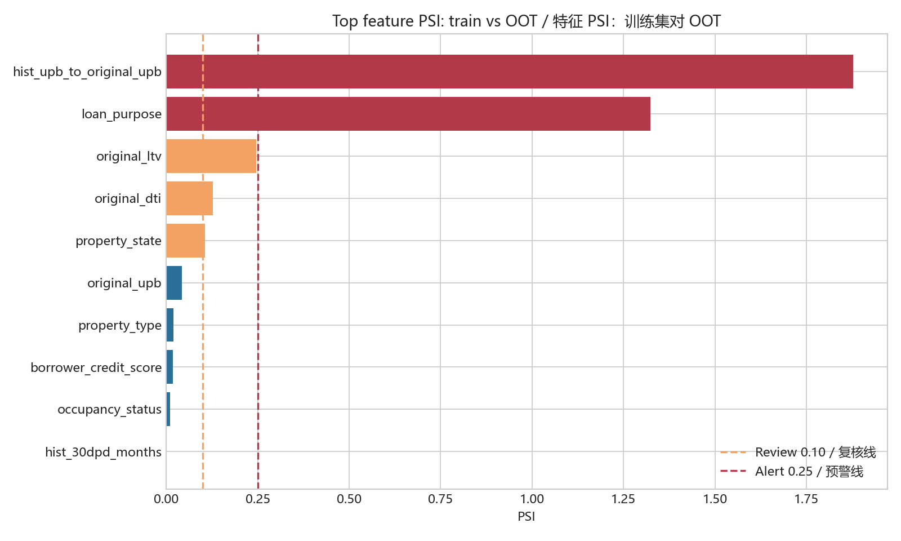
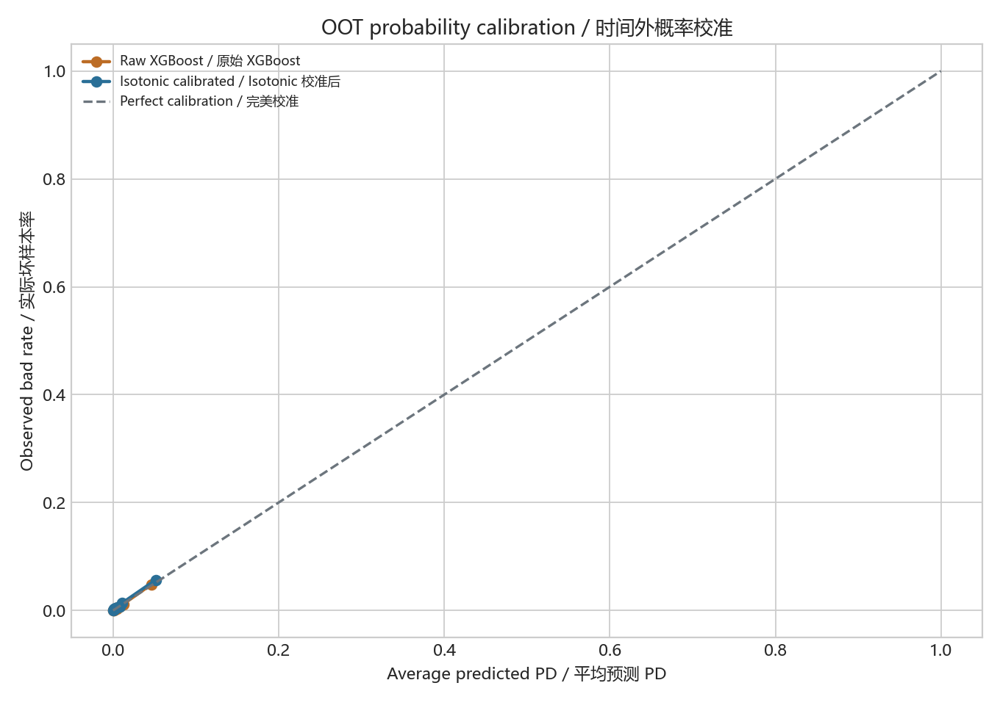

# Credit Risk Workbench / 信贷风险评分与策略监控平台

It turns Fannie Mae mortgage performance records into an auditable workflow: point-in-time data preparation, PD modelling, policy simulation and portfolio monitoring.

项目将 Fannie Mae 按揭贷款表现记录转换为一条可审计工作流：时点数据加工、PD 建模、准入策略模拟与组合监控。

## What this project answers / 解决的问题

**Given origination attributes and the first six months of payment behaviour, how can a lender estimate the probability of 90+ DPD in the following 12 months, turn it into pass/review/reject policy bands, and monitor whether that policy is becoming unreliable?**

**给定贷款起源信息和前六个月还款行为，如何估计未来 12 个月内发生 90 天以上逾期的概率，将其转化为通过/人工审核/拒绝策略，并持续监控策略是否因客群或数据变化而失效？**

## Current evidence / 当前结果

All models use the same chronological OOT protocol: 750,000-row stratified training cap before `2024-04-01`, with 131,334 final OOT observations from 2024Q2-2024Q3.

所有模型使用相同的时间外验证协议：`2024-04-01` 之前最多 75 万条分层训练样本，最终 OOT 测试集为 2024Q2-2024Q3 的 131,334 条观察样本。

| Model / 模型 | Role / 角色 | OOT AUC | OOT KS | PR-AUC | Brier |
| --- | --- | ---: | ---: | ---: | ---: |
| Logistic regression / 逻辑回归 | Explainable baseline / 可解释基准 | 0.841 | 0.522 | 0.252 | 0.00699 |
| XGBoost / XGBoost | Current strategy candidate / 当前策略候选 | **0.857** | **0.540** | **0.264** | **0.00691** |
| LightGBM / LightGBM | Stability challenger / 稳定性挑战者 | 0.853 | 0.535 | 0.254 | 0.00698 |

Key decision: XGBoost remains the strategy candidate because it ranks risk slightly better. LightGBM is retained as a reproducible challenger because its train-to-OOT score PSI is lower (`0.187` vs XGBoost `0.267`). A separate non-leaking isotonic calibration study did **not** improve final OOT Brier or ECE, so raw XGBoost PD remains the current policy input.

核心决策：XGBoost 的风险排序略优，因此当前策略使用它；LightGBM 作为可复现挑战者保留，因为其训练到 OOT 的分数 PSI 更低（`0.187` 对 XGBoost `0.267`）。独立且不泄漏的 Isotonic 校准研究没有改善最终 OOT 的 Brier 或 ECE，因此当前策略仍使用原始 XGBoost PD。

## Selected outputs / 核心产出预览

| OOT model evidence / 时间外模型证据 | Policy trade-off / 策略权衡 |
| --- | --- |
|  |  |
| Feature PSI monitoring / 特征 PSI 监控 | Probability calibration study / 概率校准研究 |
|  |  |

## Data and label / 数据与标签

- **Source / 来源:** Official Fannie Mae Single-Family Loan Performance Data. It is downloadable after registration and acceptance of Fannie Mae terms; raw files are deliberately not redistributed here.
- **Files used / 使用文件:** 2021Q1, 2022Q1, 2023Q1 and 2024Q1 combined monthly files, placed under `data/raw/fannie_mae/`.
- **Snapshot / 时点快照:** Months-on-book 1-6 form the feature window. Months 7-18 form the outcome window.
- **Bad definition / 坏样本定义:** any `current_delinquency_status >= 3` during the 12-month outcome window, meaning **90+ DPD**.
- **Eligible output / 可用产出:** 2,015,703 loan snapshots after requiring a complete six-month feature and 12-month outcome window.

The actual input is a combined monthly record, not separate tables. See [data source notes](docs/main_data_source.md) for the raw record structure and field mapping.

原始输入是合并的月度记录，而不是两张分开的起源表和表现表。字段结构与映射见[数据源说明](docs/main_data_source.md)。

## Workflow / 工作流

1. **Point-in-time data build / 时点数据构建** - Streams raw monthly files, enforces the feature/label windows and produces leakage-controlled loan snapshots.
2. **Model governance / 模型治理** - Compares logistic regression, XGBoost and LightGBM under one OOT protocol using AUC, KS, PR-AUC, Brier and PSI.
3. **Probability validation / 概率验证** - Holds out 2023Q3 for calibration, then validates raw versus calibrated PD only on 2024Q2-Q3.
4. **Decision policy / 准入策略** - Uses XGBoost PD to simulate pass, manual review and reject bands, reporting acceptance, observed bad rate, booked expected loss and rejected expected loss avoided.
5. **Portfolio health / 组合健康度** - Tracks bad rate, average PD, score PSI, feature PSI, missingness and domain-invalid values.
6. **Streamlit workbench / Streamlit 工作台** - Presents the above without rereading raw data or retraining in the UI.

## Reproduce / 复现

### 1. Install base environment / 安装基础环境

```powershell
python -m pip install -r requirements.txt
```

### 2. Download data / 下载数据

Register at the [Fannie Mae data portal](https://capitalmarkets.fanniemae.com/credit-risk-transfer/single-family-credit-risk-transfer/fannie-mae-single-family-loan-performance-data), accept its terms, and place the four Q1 combined files here:

```text
data/raw/fannie_mae/2021Q1.csv
data/raw/fannie_mae/2022Q1.csv
data/raw/fannie_mae/2023Q1.csv
data/raw/fannie_mae/2024Q1.csv
```

### 3. Generate outputs / 生成结果

```powershell
python src/fannie_combined_pipeline.py
python src/oot_risk_modelling.py
python src/lightgbm_oot_challenger.py  # Run from the fin_risk environment below
python src/strategy_simulation.py
python src/monitoring.py
python src/portfolio_health_monitoring.py
python src/calibration_validation.py
```

LightGBM is pinned in a separate Python 3.10 environment because of a Windows native-library issue in the original base environment:

```powershell
conda env create -f environment.yml
conda run -n fin_risk python src/lightgbm_oot_challenger.py
```

### 4. Launch the workbench / 启动工作台

```powershell
streamlit run app.py
```

## Repository layout / 项目结构

```text
app.py                                  # Streamlit workbench / 工作台
src/fannie_combined_pipeline.py         # Combined monthly file -> PD snapshot
src/oot_risk_modelling.py               # Logistic + XGBoost OOT evidence
src/lightgbm_oot_challenger.py          # LightGBM challenger
src/strategy_simulation.py              # Pass/review/reject scenarios
src/monitoring.py                       # Score and cohort monitoring
src/portfolio_health_monitoring.py      # Feature PSI and data-quality rules
src/calibration_validation.py           # Non-leaking calibration study
docs/model_card.md                      # Intended use, evidence and limits
docs/model_selection_decision.md        # Champion-challenger decision record
docs/main_data_source.md                # Source structure and field mapping
```

## Important limitations / 重要限制

- This is a portfolio demonstration, not a production credit decision system.
- The label is 90+ DPD, not realized net loss or foreclosure. LGD in strategy simulation is an assumption.
- The files are Q1 downloads, so available observations are not a continuous calendar panel; the time split follows actual observation dates.
- High train-to-OOT PSI requires investigation before any production claim. Feature PSI identifies where to investigate, not the causal reason for movement.
- Raw Fannie Mae data, generated loan-level outputs and reports are excluded from Git for privacy, terms-of-use and repository size reasons.

## Project notes / 项目说明

- [Model card / 模型卡](docs/model_card.md)
- [Model selection decision / 模型选择决策](docs/model_selection_decision.md)
- [Data source and structure / 数据源与结构](docs/main_data_source.md)
- [Project talking notes / 项目讲解笔记](docs/project_talking_notes.md)
- [GitHub release checklist / GitHub 发布检查清单](docs/github_release_checklist.md)
